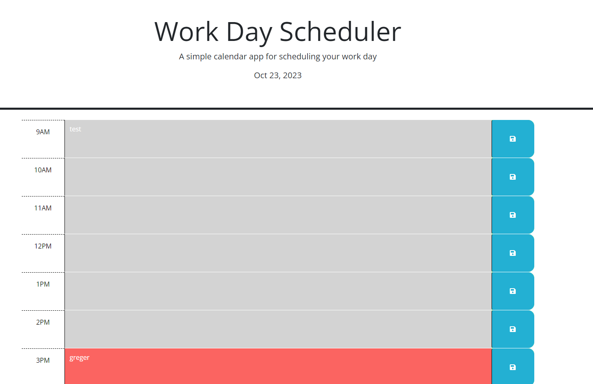

# daily_scheduler
Daily Scheduler---calendar for a day

## Description
Daily Scheduler is a webpage to log tasks by hour for a single workday. Users can input a task for the hour, save it to local storage, and have the task persist when the page is refreshed. User can easily see the current task with a color coded system that tracks the current time and sets each timeblock to a different color for past, present, and future hours. The webpage refreshes at the start of every hour so the webpage is always current.

## User Story
AS AN employee with a busy schedule
I WANT to add important events to a daily planner
SO THAT I can manage my time effectively

## Acceptance Criteria
GIVEN I am using a daily planner to create a schedule
WHEN I open the planner
THEN the current day is displayed at the top of the calendar
WHEN I scroll down
THEN I am presented with timeblocks for standard business hours of 9am&ndash;5pm
WHEN I view the timeblocks for that day
THEN each timeblock is color coded to indicate whether it is in the past, present, or future
WHEN I click into a timeblock
THEN I can enter an event
WHEN I click the save button for that timeblock
THEN the text for that event is saved in local storage
WHEN I refresh the page
THEN the saved events persist

## Screenshot

## Link to Live Webpage